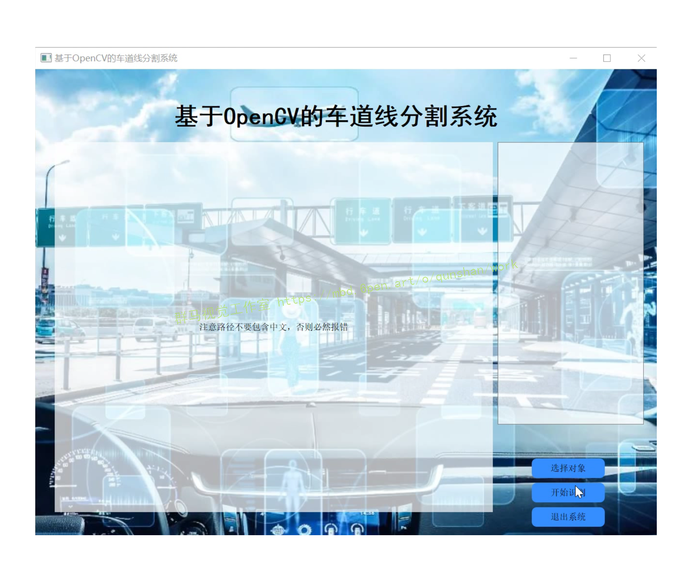
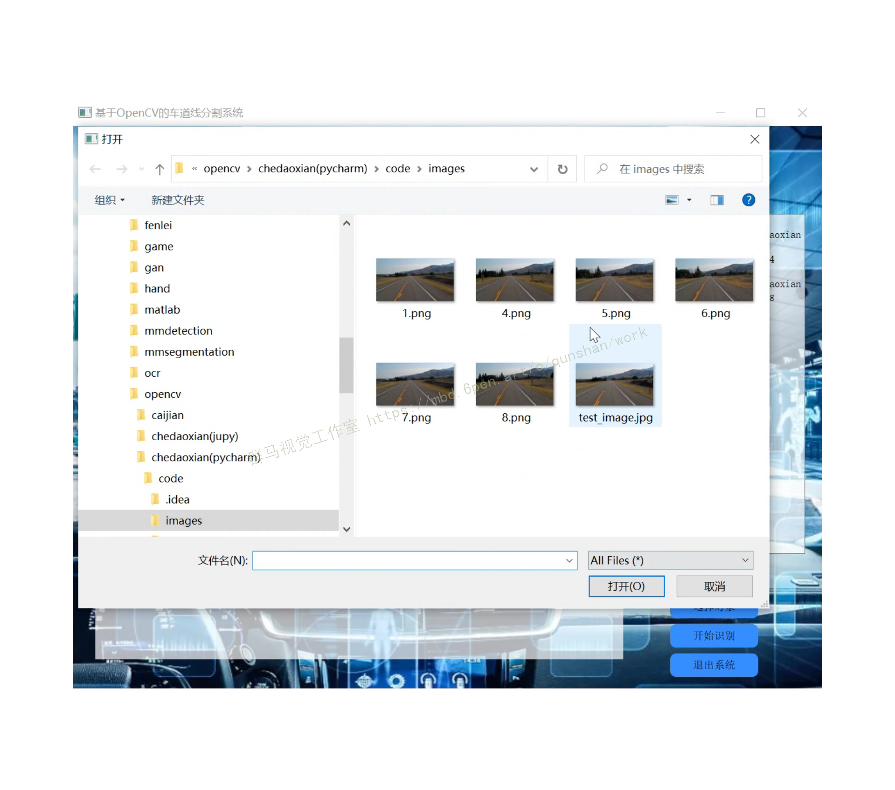
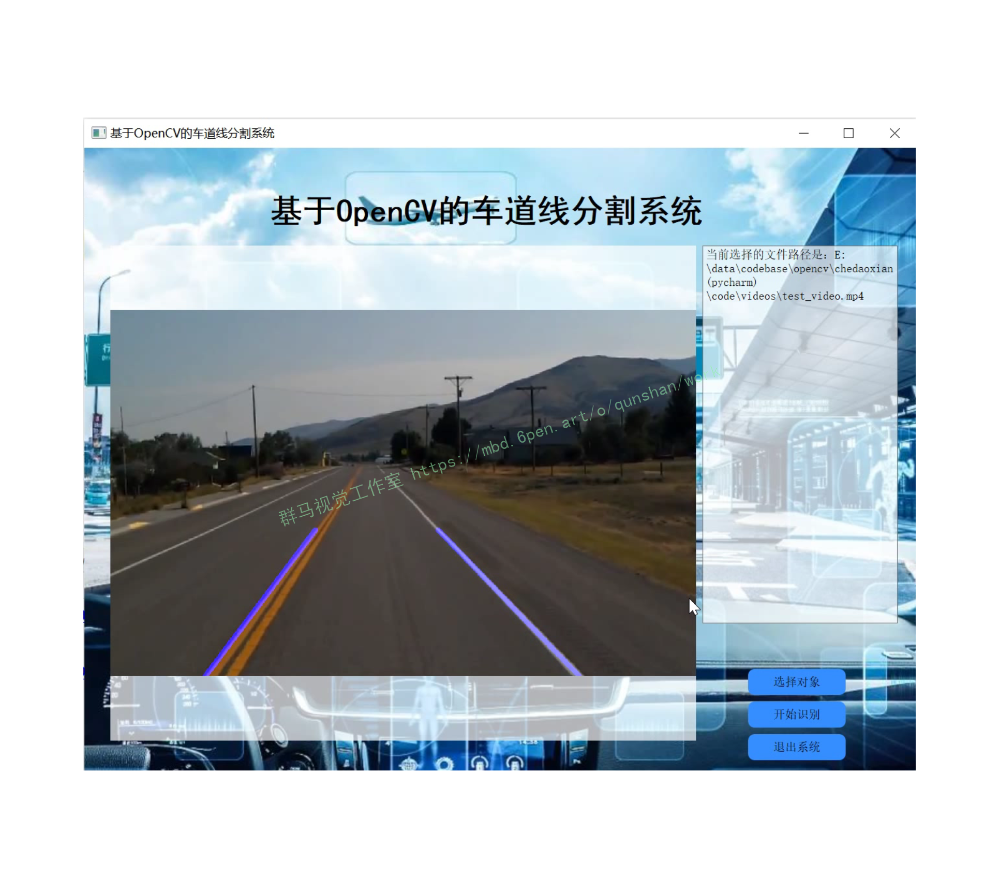
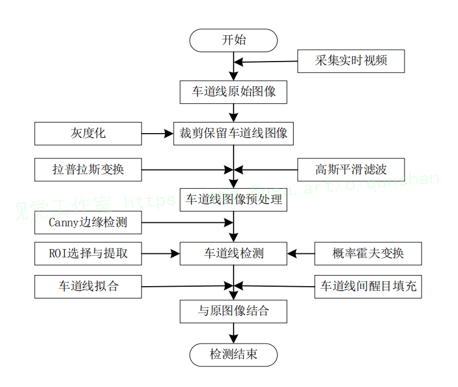
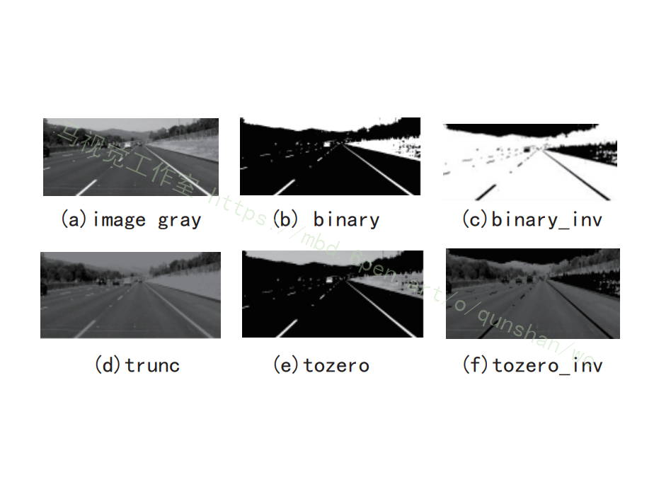
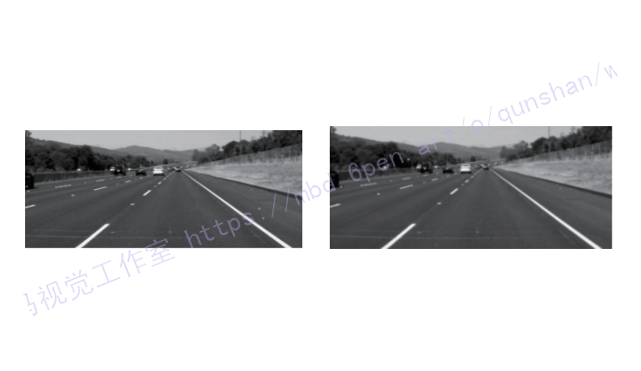
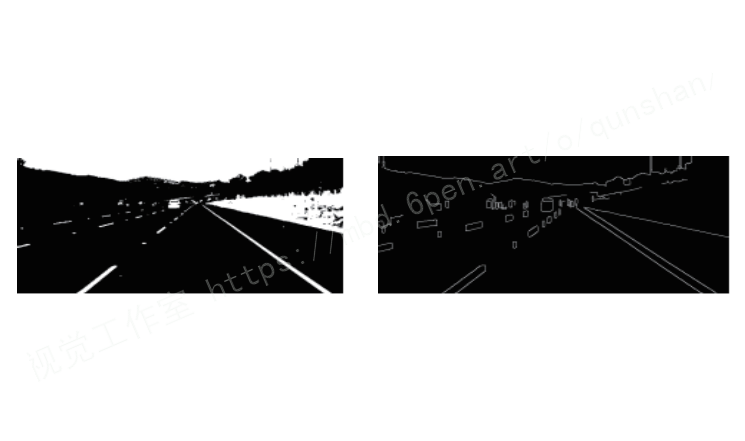
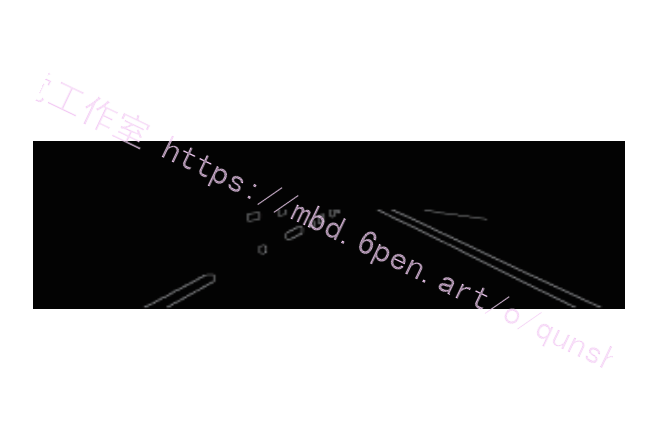
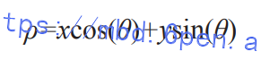
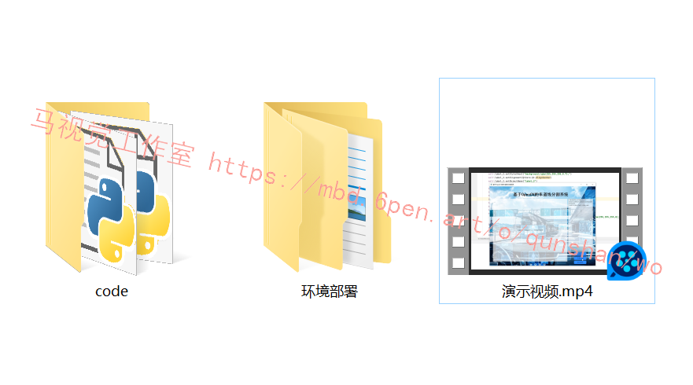

# 1.研究背景
随着无人车驾驶技术的飞速发展,对车道线检测技术的实时性也提出了更高的要求.基于OpenCV对车道线进行检测,首先对车载系统采集的图像进行裁剪随、灰度化、然后对灰度化的图像进行滤波,增强图像质量,接着对增强后的图像进行膨胀处理并对其进行边缘检测,最后选取感兴趣区域、概率霍夫直线变换及拟合.从而得出预想车道线检测图像.实验表明:将采集到的图像进行两次裁剪能够使车辆车道线图像进行高效、实时性并且高精度的检测,适用于户外高速行驶的车辆进行车道线检测。

# 2.图片演示





# 3.视频演示
[基于OpenCV的车道线实时检测系统（源码＆教程）_哔哩哔哩_bilibili](https://www.bilibili.com/video/BV1ze4y1V7Hn/?vd_source=bc9aec86d164b67a7004b996143742dc)

# 4.算法流程图


# 5.高斯滤波
高斯滤波经常用于去除图像当中的一些高斯噪声，目前常用的图像滤波技术主要分为空域滤波技术与频域滤波技术，由于本文对车道线检测的实时性要求较高以及在频域滤波时高频信号不会被污染，故选取频域当中的高斯滤波 , 高斯滤波实质上就是低通滤波，如图所示。


降噪前后对比如图：


# 6.图像自适应边缘提取
[该博客提出的方案](https://mbd.pub/o/bread/Y52cl5ly)，在对采集到的图形经过灰度化，高斯平滑滤波之后，得到的图像有所增强，但是其灰度等级依旧是 256 级，对后续的车道线检测工作会产生影响。因此本文采用最大类间方差技术和二值化技术对图像进行处理，从而排除图像中的一些干扰，使图像在车道线检测中的准确率和检测效率得以提升。阈值的选择由采集的图像所决定，本文采用最大类间方差法 (otsu)与 OpenCV 库中的函数 CV2.Threshold(img,0,255,cv2.THRESH_BINARY+ CV2.OTSU)，如图所示。图像边缘提取的技术主要有：Sobel、Laplace、Canny、Roberts 以及 Prewitt 等边缘检测算法。由于 Canny 算子可以检测更多的车道线边缘信息，本文采用 Canny 边缘检测算子 对最大类间方差处理后的图像进行边缘检测 , 检测图像如图所示：


# 7.车道线感兴趣区域划分
由于车载摄像头所采取的图像像素一般为 616×808，分辨率较好，但是其中包含了车辆、天空、行道树、房屋、弱势交通等非车道的信息。为了提高车道线检测的效率与精度以及减少检测时间，故本文对车载摄像头所采集的图像进行感兴趣区域划分与选取。根据实际情况以及大量实验结果分析，车道线的有效信息一般都分布于图像的下半部分，因此本文对采集的图片进行裁剪，仅保留图像的下半部分，这样有利于减少后期检测运算时间以及检测精度。对图像进行裁剪采用的是 PIL 库中的 crop() 函数。在对图像进行边缘检测后，须进一步对其进行感兴趣区域选取，并对所选取的感兴趣区域信息与所选取的掩码 (mask) 进行按位与操作进而得到更为精准的车道线信息，如图所示：


# 8.霍夫变换直线检测
在对感兴趣区域划分之后，为了将该区域中的直线检测出来，并实现感兴趣区域图像从笛卡尔 x-y 坐标系到霍夫 k-b坐标系的转换。本文在进行直线检测时选用的是概率霍夫变换函数。为了能更加清楚的检测直线，[参考该博客对概率霍夫变换进行了如下改进](https://afdian.net/item?plan_id=73baa36c8c0a11edbd8852540025c377)：
（1）接受直线最小长度。如果检测到的直线很短，则抑制这条直线。
（2）接受直线时允许最大像素间距。如果由多个像素点构成的直线，但是构成直线像素间的像素距离很大，则不接受。
霍夫变换原理如下：
（1）本质为检测直线上的所有像素点，即找到符合一元一次函数 y=kx+b 的所有点 (x0,y0) 的方法；
（2）对笛卡尔坐标系 y=kx+b 变换为 b=-xk+y 的形式，笛卡尔坐标系直线上的点在霍夫坐 标系上都体现出经过(k,b) 的直线，这样将检测点变为检测直线；
（3）图像中所有的点在霍夫坐标系中表示各种直线，如果找到直线的交点那么就找到了笛卡尔坐标系中的直线。霍夫变换本质就是将平面中的任一条直线都用极坐标系表
示，其公式为：


# 9.代码实现
```
import cv2
import numpy as np


def make_coordinates(image,line_parameters):
    slope, intercept = line_parameters
    y1 = image.shape[0]  # Height
    y2 = int(y1 * (3/5))
    x1 = int((y1 - intercept)/slope)
    x2 = int((y2 - intercept)/slope)
    return np.array([x1,y1,x2,y2]) 

def average_slope_intercept(image,lines):
    left_fit = []
    right_fit = []
    for line in lines:
        x1,y1,x2,y2 = line.reshape(4)
        parameters = np.polyfit((x1,x2),(y1,y2),1)
        slope = parameters[0]
        intercept = parameters[1]
        if slope<0:
            left_fit.append((slope,intercept))
        else :
            right_fit.append((slope,intercept))
    left_fit_average = np.average(left_fit,axis=0)
    right_fit_average = np.average(right_fit,axis=0)
    left_line = make_coordinates(image,left_fit_average)
    right_line = make_coordinates(image,right_fit_average)
    return np.array([left_line,right_line])


def canny(image):
    gray = cv2.cvtColor(image,cv2.COLOR_RGB2GRAY)
    blur = cv2.GaussianBlur(gray,(5,5),0)   # Kernel size is 5x5
    canny = cv2.Canny(blur,50,150)
    return canny

def display_lines(image,lines):
    line_image = np.zeros_like(image)
    if lines is not None:
        for line in lines:
            x1,y1,x2,y2 = line.reshape(4)  # Reshaping all the lines to a 1D array.
            cv2.line(line_image,(x1,y1),(x2,y2),(255,0,0),10) # Draw a Blue Line(BGR in OpenCV)
    return line_image
```

# 10.系统整合
下图[完整源码＆环境部署视频教程＆自定义UI界面](https://s.xiaocichang.com/s/32c7d4)

参考博客[《基于OpenCV的车道线实时检测系统（源码＆教程）》](https://mbd.pub/o/qunma/work)

# 11.参考文献
***
[1][刘丹萍](https://s.wanfangdata.com.cn/paper?q=%E4%BD%9C%E8%80%85:%22%E5%88%98%E4%B8%B9%E8%90%8D%22).[基于ROI自适应定位的复杂场景车道线检测](https://d.wanfangdata.com.cn/periodical/ccsfxyxb-z202005012)[J].[长春师范大学学报（自然科学版）](https://sns.wanfangdata.com.cn/perio/ccsfxyxb-z).2020,(5).

[2][白松让](https://s.wanfangdata.com.cn/paper?q=%E4%BD%9C%E8%80%85:%22%E7%99%BD%E6%9D%BE%E8%AE%A9%22),[段敏](https://s.wanfangdata.com.cn/paper?q=%E4%BD%9C%E8%80%85:%22%E6%AE%B5%E6%95%8F%22),[曹景胜](https://s.wanfangdata.com.cn/paper?q=%E4%BD%9C%E8%80%85:%22%E6%9B%B9%E6%99%AF%E8%83%9C%22),等.[基于OpenCV的车道线智能检测和识别](https://d.wanfangdata.com.cn/periodical/lngxyxb202002006)[J].[辽宁工业大学学报（自然科学版）](https://sns.wanfangdata.com.cn/perio/lngxyxb).2020,(2).DOI:[10.15916/j.issn1674-3261.2020.02.006](http://dx.chinadoi.cn/10.15916/j.issn1674-3261.2020.02.006).

[3][张道芳](https://s.wanfangdata.com.cn/paper?q=%E4%BD%9C%E8%80%85:%22%E5%BC%A0%E9%81%93%E8%8A%B3%22),[张儒良](https://s.wanfangdata.com.cn/paper?q=%E4%BD%9C%E8%80%85:%22%E5%BC%A0%E5%84%92%E8%89%AF%22).[基于语义分割的车道线检测算法研究](https://d.wanfangdata.com.cn/periodical/qgsj201906005)[J].[科技创新与应用](https://sns.wanfangdata.com.cn/perio/qgsj).2019,(6).DOI:[10.3969/j.issn.2095-2945.2019.06.005](http://dx.chinadoi.cn/10.3969/j.issn.2095-2945.2019.06.005).

[4][姜良超](https://s.wanfangdata.com.cn/paper?q=%E4%BD%9C%E8%80%85:%22%E5%A7%9C%E8%89%AF%E8%B6%85%22),[李传友](https://s.wanfangdata.com.cn/paper?q=%E4%BD%9C%E8%80%85:%22%E6%9D%8E%E4%BC%A0%E5%8F%8B%22),[殷凡青](https://s.wanfangdata.com.cn/paper?q=%E4%BD%9C%E8%80%85:%22%E6%AE%B7%E5%87%A1%E9%9D%92%22).[基于OpenCV的车道线检测](https://d.wanfangdata.com.cn/periodical/mtcjs201808004)[J].[摩托车技术](https://sns.wanfangdata.com.cn/perio/mtcjs).2018,(8).DOI:[10.3969/j.issn.1001-7666.2018.08.004](http://dx.chinadoi.cn/10.3969/j.issn.1001-7666.2018.08.004).

[5][唐阳山](https://s.wanfangdata.com.cn/paper?q=%E4%BD%9C%E8%80%85:%22%E5%94%90%E9%98%B3%E5%B1%B1%22),[李栋梁](https://s.wanfangdata.com.cn/paper?q=%E4%BD%9C%E8%80%85:%22%E6%9D%8E%E6%A0%8B%E6%A2%81%22),[朱停仃](https://s.wanfangdata.com.cn/paper?q=%E4%BD%9C%E8%80%85:%22%E6%9C%B1%E5%81%9C%E4%BB%83%22),等.[基于canny和霍夫变换的车道线识别算法研究](https://d.wanfangdata.com.cn/periodical/qcsyjs201722031)[J].[汽车实用技术](https://sns.wanfangdata.com.cn/perio/qcsyjs).2017,(22).DOI:[10.16638/j.cnki.1671-7988.2017.22.029](http://dx.chinadoi.cn/10.16638/j.cnki.1671-7988.2017.22.029).

[6][王宝锋](https://s.wanfangdata.com.cn/paper?q=%E4%BD%9C%E8%80%85:%22%E7%8E%8B%E5%AE%9D%E9%94%8B%22),[齐志权](https://s.wanfangdata.com.cn/paper?q=%E4%BD%9C%E8%80%85:%22%E9%BD%90%E5%BF%97%E6%9D%83%22),[马国成](https://s.wanfangdata.com.cn/paper?q=%E4%BD%9C%E8%80%85:%22%E9%A9%AC%E5%9B%BD%E6%88%90%22),等.[基于线性逼近的车道线弯道识别方法](https://d.wanfangdata.com.cn/periodical/bjlgdxxb201605006)[J].[北京理工大学学报](https://sns.wanfangdata.com.cn/perio/bjlgdxxb).2016,(5).DOI:[10.15918/j.tbit1001-0645.2016.05.006](http://dx.chinadoi.cn/10.15918/j.tbit1001-0645.2016.05.006).

[7][贾会群](https://s.wanfangdata.com.cn/paper?q=%E4%BD%9C%E8%80%85:%22%E8%B4%BE%E4%BC%9A%E7%BE%A4%22).[无人驾驶车辆自主导航关键技术研究](https://d.wanfangdata.com.cn/thesis/Y3589721)[D].2019.

[8][HG Zhu](https://s.wanfangdata.com.cn/paper?q=%E4%BD%9C%E8%80%85:%22HG%20Zhu%22),[HG Zhu](https://s.wanfangdata.com.cn/paper?q=%E4%BD%9C%E8%80%85:%22HG%20Zhu%22).[An Efficient Lane Line Detection Method Based on Computer Vision](https://d.wanfangdata.com.cn/periodical/qk3e_000006687832)[J].Journal of Physics: Conference Series.2021,1802(3).032006 (8pp).DOI:[10.1088/1742-6596/1802/3/032006](http://dx.chinadoi.cn/10.1088/1742-6596/1802/3/032006).

[9][Pattas Bastos Franco, Iago Jose](https://s.wanfangdata.com.cn/paper?q=%E4%BD%9C%E8%80%85:%22Pattas%20Bastos%20Franco%2C%20Iago%20Jose%22),[Ribeiro, Tiago Trindade](https://s.wanfangdata.com.cn/paper?q=%E4%BD%9C%E8%80%85:%22Ribeiro%2C%20Tiago%20Trindade%22),[Scolari Conceicao, Andre Gustavo](https://s.wanfangdata.com.cn/paper?q=%E4%BD%9C%E8%80%85:%22Scolari%20Conceicao%2C%20Andre%20Gustavo%22).[A Novel Visual Lane Line Detection System for a NMPC-based Path Following Control Scheme](https://d.wanfangdata.com.cn/periodical/cac89ae70de14df8f3b0d4b65aef60fd)[J].[Journal of Intelligent & Robotic Systems: Theory & Application](https://sns.wanfangdata.com.cn/perio/0921-0296).2021,101(1).DOI:[10.1007/s10846-020-01278-x](http://dx.chinadoi.cn/10.1007/s10846-020-01278-x).


---
#### 如果您需要更详细的【源码和环境部署教程】，除了通过【系统整合】小节的链接获取之外，还可以通过邮箱以下途径获取:
#### 1.请先在GitHub上为该项目点赞（Star），编辑一封邮件，附上点赞的截图、项目的中文描述概述（About）以及您的用途需求，发送到我们的邮箱
#### sharecode@yeah.net
#### 2.我们收到邮件后会定期根据邮件的接收顺序将【完整源码和环境部署教程】发送到您的邮箱。
#### 【免责声明】本文来源于用户投稿，如果侵犯任何第三方的合法权益，可通过邮箱联系删除。